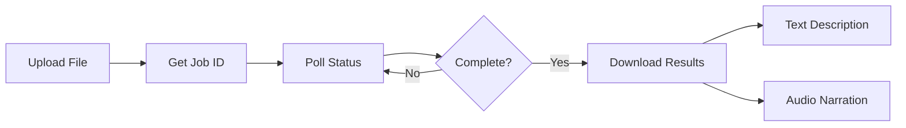

# Voice Description API - Quick Start Guide

## 🚀 Getting Started in 5 Minutes

### 1. Check API Health
```bash
curl http://localhost:3000/api/health
```

### 2. Process Your First Image
```bash
curl -X POST http://localhost:3000/api/process-image \
  -F "file=@image.jpg" \
  -F "detailLevel=comprehensive" \
  -F "generateAudio=true"
```

### 3. Process Your First Video
```bash
# Upload video
curl -X POST http://localhost:3000/api/upload \
  -F "file=@video.mp4" \
  -F "type=video" \
  -F "detailLevel=comprehensive" \
  -F "voiceId=Joanna"

# Response: {"success": true, "jobId": "550e8400-e29b..."}

# Check status
curl http://localhost:3000/api/status/550e8400-e29b...

# Download results when complete
curl http://localhost:3000/api/results/550e8400-e29b.../text -o description.txt
curl http://localhost:3000/api/results/550e8400-e29b.../audio -o narration.mp3
```

## 📊 API Endpoints Reference

| Endpoint | Method | Description | Response Time |
|----------|---------|-------------|---------------|
| `/api/health` | GET | System health check | <100ms |
| `/api/upload` | POST | Upload video/image | 1-5s |
| `/api/process-image` | POST | Process single image | 2-10s |
| `/api/process-images-batch` | POST | Batch process images | 5-60s |
| `/api/status/{jobId}` | GET | Get job status | <100ms |
| `/api/results/{jobId}/text` | GET | Download text | <500ms |
| `/api/results/{jobId}/audio` | GET | Download audio | <1s |

## 🔑 Common Parameters

### Processing Options
- `detailLevel`: "basic" | "comprehensive" | "technical"
- `generateAudio`: true | false
- `voiceId`: "Joanna" | "Matthew" | "Ruth" | "Stephen"
- `language`: "en" | "es" | "fr" | "de"

### File Types Supported
- **Video**: MP4, AVI, MOV, MKV, WebM
- **Image**: JPEG, PNG, WebP, GIF

### Size Limits
- **Video**: Max 500MB
- **Image**: Max 50MB
- **Batch**: Max 100 images

## 💻 Language-Specific Quick Starts

### JavaScript (Node.js)
```javascript
const FormData = require('form-data');
const fs = require('fs');
const axios = require('axios');

async function processVideo(filePath) {
    const form = new FormData();
    form.append('file', fs.createReadStream(filePath));
    form.append('type', 'video');
    form.append('detailLevel', 'comprehensive');
    
    const { data } = await axios.post(
        'http://localhost:3000/api/upload',
        form,
        { headers: form.getHeaders() }
    );
    
    console.log('Job ID:', data.jobId);
    return data.jobId;
}

// Poll for status
async function checkStatus(jobId) {
    const { data } = await axios.get(
        `http://localhost:3000/api/status/${jobId}`
    );
    return data;
}
```

### Python
```python
import requests
import time

def process_video(file_path):
    with open(file_path, 'rb') as f:
        files = {'file': f}
        data = {
            'type': 'video',
            'detailLevel': 'comprehensive',
            'voiceId': 'Joanna'
        }
        
        response = requests.post(
            'http://localhost:3000/api/upload',
            files=files,
            data=data
        )
        
        result = response.json()
        return result['jobId']

def wait_for_completion(job_id):
    while True:
        response = requests.get(
            f'http://localhost:3000/api/status/{job_id}'
        )
        status = response.json()
        
        if status['status'] == 'completed':
            return status
        elif status['status'] == 'failed':
            raise Exception(f"Job failed: {status['message']}")
        
        print(f"Progress: {status['progress']}%")
        time.sleep(2)
```

### React
```jsx
import { useState } from 'react';

function VideoUploader() {
    const [file, setFile] = useState(null);
    const [jobId, setJobId] = useState(null);
    const [status, setStatus] = useState(null);

    const handleUpload = async () => {
        const formData = new FormData();
        formData.append('file', file);
        formData.append('type', 'video');
        formData.append('detailLevel', 'comprehensive');

        const response = await fetch('/api/upload', {
            method: 'POST',
            body: formData
        });

        const data = await response.json();
        setJobId(data.jobId);
        pollStatus(data.jobId);
    };

    const pollStatus = async (id) => {
        const interval = setInterval(async () => {
            const response = await fetch(`/api/status/${id}`);
            const data = await response.json();
            
            setStatus(data);
            
            if (data.status === 'completed' || data.status === 'failed') {
                clearInterval(interval);
            }
        }, 2000);
    };

    return (
        <div>
            <input
                type="file"
                onChange={(e) => setFile(e.target.files[0])}
            />
            <button onClick={handleUpload}>Upload</button>
            
            {status && (
                <div>
                    <p>Status: {status.status}</p>
                    <p>Progress: {status.progress}%</p>
                </div>
            )}
        </div>
    );
}
```

## 🔄 Processing Workflow



## 📈 Response Examples

### Successful Upload
```json
{
    "success": true,
    "jobId": "550e8400-e29b-41d4-a716-446655440000",
    "message": "Upload successful, processing started",
    "estimatedTime": 300
}
```

### Job Status (Processing)
```json
{
    "jobId": "550e8400-e29b-41d4-a716-446655440000",
    "status": "processing",
    "step": "analysis",
    "progress": 45,
    "message": "Analyzing scene 5 of 10",
    "segmentCount": 10,
    "currentSegment": 5,
    "estimatedTimeRemaining": 150
}
```

### Job Status (Completed)
```json
{
    "jobId": "550e8400-e29b-41d4-a716-446655440000",
    "status": "completed",
    "step": "completed",
    "progress": 100,
    "message": "Processing complete",
    "results": {
        "textUrl": "/api/results/550e8400/text",
        "audioUrl": "/api/results/550e8400/audio"
    }
}
```

### Image Processing Result
```json
{
    "success": true,
    "data": {
        "jobId": "550e8400",
        "status": "completed",
        "processingTime": 3500,
        "results": {
            "detailedDescription": "A serene mountain landscape...",
            "altText": "Mountain landscape with lake",
            "visualElements": ["mountains", "lake", "sunset"],
            "colors": ["blue", "orange", "green"],
            "confidence": 0.95,
            "audioFile": {
                "url": "https://cdn.example.com/audio/550e8400.mp3",
                "duration": 12.5,
                "format": "mp3"
            }
        }
    }
}
```

## ⚡ Performance Tips

### 1. Use Batch Processing
Instead of processing images one by one, use batch endpoint:
```javascript
// Inefficient
for (const image of images) {
    await processImage(image);
}

// Efficient
await processBatchImages(images);
```

### 2. Implement Proper Polling
```javascript
// Start with 2s, increase to max 30s
let interval = 2000;
const poll = async () => {
    const status = await getStatus(jobId);
    if (status.status === 'processing') {
        interval = Math.min(interval * 1.5, 30000);
        setTimeout(poll, interval);
    }
};
```

### 3. Use Concurrent Requests Wisely
```javascript
// Process up to 3 files concurrently
const results = await Promise.all(
    files.slice(0, 3).map(file => processFile(file))
);
```

### 4. Cache Results
```javascript
const cache = new Map();

async function getCachedOrProcess(file) {
    const key = file.name;
    if (cache.has(key)) {
        return cache.get(key);
    }
    
    const result = await processFile(file);
    cache.set(key, result);
    return result;
}
```

## 🔧 Error Handling

### Common Error Codes
| Code | Meaning | Solution |
|------|---------|----------|
| 400 | Bad Request | Check file format and parameters |
| 413 | File Too Large | Reduce file size below limits |
| 429 | Rate Limited | Implement backoff and retry |
| 500 | Server Error | Retry with exponential backoff |
| 503 | Service Unavailable | AWS services down, retry later |

### Error Handling Example
```javascript
async function processWithRetry(file, maxRetries = 3) {
    for (let i = 0; i < maxRetries; i++) {
        try {
            return await processFile(file);
        } catch (error) {
            if (error.response?.status === 429) {
                // Rate limited - wait longer
                await sleep(Math.pow(2, i) * 5000);
            } else if (error.response?.status >= 500) {
                // Server error - retry with backoff
                await sleep(Math.pow(2, i) * 1000);
            } else {
                // Client error - don't retry
                throw error;
            }
        }
    }
    throw new Error('Max retries exceeded');
}
```

## 🔐 Authentication (Optional)

If API key is required:
```javascript
// JavaScript
headers: {
    'Authorization': 'Bearer YOUR_API_KEY'
}

// Python
headers = {
    'Authorization': 'Bearer YOUR_API_KEY'
}

// cURL
-H "Authorization: Bearer YOUR_API_KEY"
```

## 📱 WebSocket Support (Coming Soon)

Real-time status updates:
```javascript
const ws = new WebSocket('ws://localhost:3000');

ws.onopen = () => {
    ws.send(JSON.stringify({
        type: 'subscribe',
        jobId: '550e8400...'
    }));
};

ws.onmessage = (event) => {
    const update = JSON.parse(event.data);
    console.log('Progress:', update.progress);
};
```

## 🛠️ Development Tools

### Postman Collection
Import the collection from `API_DOCUMENTATION.md` to get started quickly.

### CLI Tool
```bash
# Install globally
npm install -g voice-description-cli

# Use commands
vd-cli upload video.mp4 --comprehensive
vd-cli status 550e8400
vd-cli download 550e8400 text
```

### Docker Testing
```bash
# Run API locally
docker run -p 3000:3000 voice-description-api

# Test with sample files
docker run -v $(pwd):/data voice-description-api \
    process /data/sample.mp4
```

## 📞 Support

- **Documentation**: See `API_DOCUMENTATION.md` for complete reference
- **SDK Examples**: See `SDK_EXAMPLES.md` for language-specific implementations
- **GitHub Issues**: Report bugs and request features
- **Email Support**: support@voicedescription.com

## 🎯 Next Steps

1. **Test the API**: Use the health endpoint to verify connection
2. **Try an Image**: Process a single image to see results quickly
3. **Process a Video**: Upload a short video for full workflow
4. **Implement Polling**: Add proper status checking
5. **Handle Errors**: Implement retry logic
6. **Optimize**: Use batch processing for multiple files
7. **Monitor**: Track processing times and success rates

## 📋 Checklist for Production

- [ ] Implement authentication if required
- [ ] Add error handling and retries
- [ ] Set up monitoring and logging
- [ ] Implement caching for results
- [ ] Use environment variables for configuration
- [ ] Add request/response logging
- [ ] Implement circuit breaker pattern
- [ ] Set up webhook endpoints for notifications
- [ ] Add metrics collection
- [ ] Create health check monitoring

---

**Ready to start?** Copy any of the code examples above and begin processing your media files for accessibility!