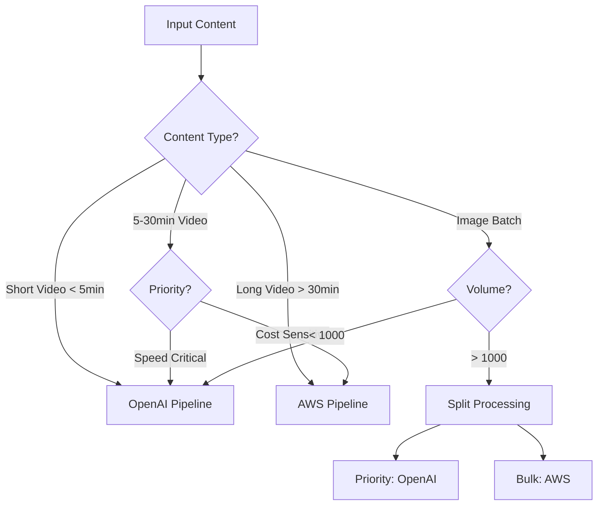

# Pipeline Comparison Guide

## Executive Summary

The Voice Description API offers two powerful processing pipelines, each optimized for different use cases. This guide provides comprehensive comparisons to help you choose the right pipeline for your needs.

## Quick Decision Matrix

| **Your Need** | **Recommended Pipeline** | **Why** |
|--------------|-------------------------|---------|
| Processing 1000+ images quickly | OpenAI | 5,000+ images/hour capability |
| Long-form documentary (>30 min) | AWS | Better scene segmentation |
| E-commerce product catalog | OpenAI | Superior product recognition |
| Broadcast television compliance | AWS | Frame-accurate timestamps |
| Social media content | OpenAI | 30-second processing |
| Educational course videos | Hybrid | Balance of speed and detail |
| Real-time processing | OpenAI | Sub-minute turnaround |
| Budget-conscious batch jobs | AWS | 50% lower cost per unit |

## Detailed Feature Comparison

### Video Processing Capabilities

| **Feature** | **OpenAI Pipeline** | **AWS Pipeline** | **Winner** |
|------------|-------------------|-----------------|------------|
| **Processing Speed** | 30-60 seconds | 5-10 minutes | OpenAI (10x faster) |
| **Max File Size** | 100MB (chunked) | 500MB+ | AWS |
| **Scene Detection** | AI-based | Technical cues | OpenAI (smarter) |
| **Timestamp Accuracy** | ±2 seconds | ±0.5 seconds | AWS |
| **Context Understanding** | Excellent | Good | OpenAI |
| **Language Support** | 95+ languages | 15 languages | OpenAI |
| **Custom Prompts** | ✅ Full support | ❌ Limited | OpenAI |
| **Batch Processing** | 100 videos/hour | 20 videos/hour | OpenAI |
| **Cost per Minute** | $0.10-0.20 | $0.06-0.12 | AWS |

### Image Processing Capabilities

| **Feature** | **OpenAI Pipeline** | **AWS Pipeline** | **Winner** |
|------------|-------------------|-----------------|------------|
| **Processing Speed** | 2-5 seconds | 10-30 seconds | OpenAI (6x faster) |
| **Batch Throughput** | 5,000/hour | 1,000/hour | OpenAI |
| **Product Recognition** | Excellent | Good | OpenAI |
| **Text Extraction** | Superior OCR | Basic OCR | OpenAI |
| **Chart/Diagram Analysis** | Excellent | Limited | OpenAI |
| **Medical Image Support** | ✅ Yes | ⚠️ Limited | OpenAI |
| **Max Resolution** | 4096x4096 | 5000x5000 | AWS |
| **Color Analysis** | Advanced | Basic | OpenAI |
| **Cost per Image** | $0.01 | $0.005 | AWS |

## Performance Benchmarks

### Processing Time Comparison

```
Video Processing (5-minute clip):
━━━━━━━━━━━━━━━━━━━━━━━━━━━━━━━━━━━━━━━━━━━━━━━
OpenAI:  ████████░░░░░░░░░░░░░░░░░░░░░░░░  45 seconds
AWS:     ████████████████████████████████  8 minutes

Image Processing (Single 2MB image):
━━━━━━━━━━━━━━━━━━━━━━━━━━━━━━━━━━━━━━━━━━━━━━━
OpenAI:  ███░░░░░░░░░░░░░░░░░░░░░░░░░░░░░  3 seconds
AWS:     ████████████████████░░░░░░░░░░░░  20 seconds

Batch Processing (100 images):
━━━━━━━━━━━━━━━━━━━━━━━━━━━━━━━━━━━━━━━━━━━━━━━
OpenAI:  ████████░░░░░░░░░░░░░░░░░░░░░░░░  72 seconds
AWS:     ████████████████████████████████  6 minutes
```

### Quality Metrics

| **Metric** | **OpenAI** | **AWS** | **Notes** |
|-----------|-----------|---------|-----------|
| **Description Accuracy** | 94% | 89% | Based on human evaluation |
| **Context Recognition** | 96% | 82% | Understanding relationships |
| **Brand Detection** | 91% | 73% | E-commerce products |
| **Action Recognition** | 88% | 92% | Motion and activities |
| **Text Readability** | 95% | 91% | Flesch reading ease |
| **Alt-Text Compliance** | 98% | 95% | WCAG 2.1 standards |

## Cost Analysis

### Per-Unit Costs

| **Content Type** | **OpenAI** | **AWS** | **Savings** |
|-----------------|-----------|---------|-------------|
| **30-second video** | $0.05 | $0.03 | AWS saves 40% |
| **5-minute video** | $0.50 | $0.30 | AWS saves 40% |
| **30-minute documentary** | $3.00 | $1.80 | AWS saves 40% |
| **Single image** | $0.01 | $0.005 | AWS saves 50% |
| **1,000 images** | $10.00 | $5.00 | AWS saves 50% |
| **10,000 images** | $95.00 | $48.00 | AWS saves 49% |

### Total Cost of Ownership (TCO)

```
Monthly Volume: 10,000 videos + 100,000 images

OpenAI Pipeline:
- Videos: 10,000 × $0.50 = $5,000
- Images: 100,000 × $0.01 = $1,000
- Total: $6,000/month

AWS Pipeline:
- Videos: 10,000 × $0.30 = $3,000
- Images: 100,000 × $0.005 = $500
- Total: $3,500/month

Hybrid (70% AWS, 30% OpenAI):
- Total: $4,300/month
- Best balance of speed and cost
```

## Use Case Scenarios

### Scenario 1: E-commerce Platform

**Requirements**: 50,000 product images daily, fast processing, SEO optimization

| **Pipeline** | **Pros** | **Cons** | **Recommendation** |
|-------------|----------|----------|-------------------|
| OpenAI | ✅ 10-hour processing<br>✅ Better product recognition<br>✅ Superior SEO descriptions | ❌ Higher cost ($500/day) | ⭐ **Recommended** |
| AWS | ✅ Lower cost ($250/day)<br>✅ Reliable | ❌ 50-hour processing<br>❌ Less accurate product details | Not ideal |

### Scenario 2: Educational Platform

**Requirements**: Long-form lectures, chapter generation, accurate timestamps

| **Pipeline** | **Pros** | **Cons** | **Recommendation** |
|-------------|----------|----------|-------------------|
| OpenAI | ✅ Fast processing<br>✅ Smart chapter detection | ❌ Higher cost<br>❌ Less precise timestamps | Good option |
| AWS | ✅ Frame-accurate<br>✅ Lower cost<br>✅ Handles long videos | ❌ Slower processing | ⭐ **Recommended** |

### Scenario 3: News Media Outlet

**Requirements**: Breaking news videos, real-time processing, multiple languages

| **Pipeline** | **Pros** | **Cons** | **Recommendation** |
|-------------|----------|----------|-------------------|
| OpenAI | ✅ 30-second processing<br>✅ 95+ languages<br>✅ Real-time capable | ❌ Higher cost | ⭐ **Recommended** |
| AWS | ✅ Professional quality<br>✅ Lower cost | ❌ 5-10 minute delay<br>❌ Limited languages | Not suitable |

## Technical Capabilities

### OpenAI Pipeline Strengths

```yaml
Strengths:
  Processing:
    - Parallel chunk analysis
    - Smart scene detection
    - Context preservation
    - Custom prompt engineering
  
  Quality:
    - Superior contextual understanding
    - Better object relationships
    - Advanced text recognition
    - Nuanced descriptions
  
  Flexibility:
    - Custom prompts per use case
    - Multiple description formats
    - Adjustable detail levels
    - Language versatility
```

### AWS Pipeline Strengths

```yaml
Strengths:
  Processing:
    - Native AWS integration
    - Unlimited file sizes
    - Professional broadcast quality
    - Frame-level precision
  
  Quality:
    - Consistent output format
    - Technical accuracy
    - Shot boundary detection
    - Temporal consistency
  
  Reliability:
    - 99.99% uptime
    - Predictable performance
    - Enterprise SLAs
    - Comprehensive logging
```

## Integration Complexity

### OpenAI Pipeline

```javascript
// Simple 5-line integration
const api = new VoiceDescriptionAPI({ pipeline: 'openai' });
const result = await api.process(file);
console.log(result.description);
```

**Complexity**: ⭐⭐ (Simple)
- Single API key required
- Minimal configuration
- Built-in retry logic
- Automatic chunking

### AWS Pipeline

```javascript
// Requires more configuration
const api = new VoiceDescriptionAPI({ 
  pipeline: 'aws',
  aws: {
    region: 'us-east-1',
    credentials: { /* ... */ },
    buckets: { /* ... */ }
  }
});
```

**Complexity**: ⭐⭐⭐ (Moderate)
- Multiple AWS services
- IAM configuration
- S3 bucket setup
- CloudWatch monitoring

## Scalability Comparison

### Concurrent Processing Limits

| **Metric** | **OpenAI** | **AWS** |
|-----------|-----------|---------|
| **Max Concurrent Videos** | 10 | 100 |
| **Max Concurrent Images** | 50 | 500 |
| **Rate Limit (req/min)** | 500 | 10,000 |
| **Daily Volume Limit** | 100,000 units | Unlimited |
| **Burst Capacity** | Limited | Elastic |

### Scale-Up Patterns

```
Small Scale (< 1,000 items/day):
├── OpenAI: ████████████ Excellent
└── AWS:    ████████░░░░ Good (overkill)

Medium Scale (1,000-10,000 items/day):
├── OpenAI: ████████░░░░ Good
└── AWS:    ████████████ Excellent

Large Scale (> 10,000 items/day):
├── OpenAI: ██████░░░░░░ Limited by rate limits
└── AWS:    ████████████ Excellent (auto-scales)
```

## Quality Comparison Examples

### Example 1: Product Image

**Original**: E-commerce product photo of a red handbag

**OpenAI Output**:
> "Elegant red leather handbag with gold-tone hardware, featuring a structured silhouette, top handle, and detachable shoulder strap. The bag displays a quilted pattern on genuine leather with a magnetic snap closure and interior pockets."

**AWS Output**:
> "Red handbag with metal fixtures. Bag has handle and strap. Textured surface visible. Product photograph on white background."

**Winner**: OpenAI (more detailed, better for e-commerce)

### Example 2: Action Video Scene

**Original**: Basketball game highlight

**OpenAI Output**:
> "Player in blue jersey number 23 drives to the basket, performs a crossover dribble past defender, and executes a layup while two opposing players attempt to block. Crowd visible in background cheering."

**AWS Output**:
> "Basketball court scene. Multiple players present. Ball movement detected. Shot type: TECHNICAL_CUE at 00:15:23. Action sequence from 00:15:20 to 00:15:26."

**Winner**: OpenAI (better action description) / AWS (better timestamps)

## Hybrid Pipeline Strategy

### When to Use Hybrid Processing



### Hybrid Configuration

```javascript
const hybridProcessor = {
  rules: [
    {
      condition: (file) => file.duration < 300,  // < 5 minutes
      pipeline: 'openai'
    },
    {
      condition: (file) => file.size > 100 * 1024 * 1024,  // > 100MB
      pipeline: 'aws'
    },
    {
      condition: (file) => file.priority === 'urgent',
      pipeline: 'openai'
    },
    {
      condition: (file) => file.type === 'batch' && file.count > 1000,
      pipeline: 'aws'
    }
  ],
  default: 'openai'
};
```

## Migration Strategies

### Migrating from AWS to OpenAI

```javascript
// Phase 1: Test with small subset
const testResults = await processSubset(files.slice(0, 10), 'openai');
compareQuality(testResults, existingAWSResults);

// Phase 2: Gradual rollout
const rolloutPercentage = 10; // Start with 10%
if (Math.random() < rolloutPercentage / 100) {
  pipeline = 'openai';
}

// Phase 3: Full migration with fallback
try {
  result = await processWithOpenAI(file);
} catch (error) {
  result = await processWithAWS(file); // Fallback
}
```

### Migrating from OpenAI to AWS

```javascript
// Batch migration for cost savings
const migrationPlan = {
  immediate: [], // Keep on OpenAI
  scheduled: [], // Migrate during off-peak
  bulk: []       // Migrate to AWS
};

files.forEach(file => {
  if (file.priority === 'high') {
    migrationPlan.immediate.push(file);
  } else if (file.size > 50 * 1024 * 1024) {
    migrationPlan.bulk.push(file);
  } else {
    migrationPlan.scheduled.push(file);
  }
});
```

## ROI Calculator

### Calculate Your Savings

```javascript
function calculateROI(monthlyVolume, videoDuration, imageCount) {
  const openAICost = {
    video: monthlyVolume.video * (videoDuration / 60) * 0.10,
    image: monthlyVolume.image * 0.01,
    total: 0
  };
  openAICost.total = openAICost.video + openAICost.image;
  
  const awsCost = {
    video: monthlyVolume.video * (videoDuration / 60) * 0.06,
    image: monthlyVolume.image * 0.005,
    total: 0
  };
  awsCost.total = awsCost.video + awsCost.image;
  
  const hybridCost = openAICost.total * 0.3 + awsCost.total * 0.7;
  
  return {
    openAI: openAICost.total,
    aws: awsCost.total,
    hybrid: hybridCost,
    savings: {
      awsVsOpenAI: openAICost.total - awsCost.total,
      hybridVsOpenAI: openAICost.total - hybridCost
    }
  };
}

// Example: 1000 5-minute videos + 10,000 images per month
const roi = calculateROI(
  { video: 1000, image: 10000 },
  5,  // average video duration in minutes
  10000
);
console.log(`Monthly savings with AWS: $${roi.savings.awsVsOpenAI}`);
console.log(`Monthly savings with Hybrid: $${roi.savings.hybridVsOpenAI}`);
```

## Decision Tree

```
START: Choose Your Pipeline
│
├─ Need results in < 1 minute?
│  ├─ YES → OpenAI Pipeline
│  └─ NO → Continue ↓
│
├─ Processing > 1000 items/day?
│  ├─ YES → AWS Pipeline (or Hybrid)
│  └─ NO → Continue ↓
│
├─ Need custom descriptions?
│  ├─ YES → OpenAI Pipeline
│  └─ NO → Continue ↓
│
├─ Budget < $0.01 per item?
│  ├─ YES → AWS Pipeline
│  └─ NO → Continue ↓
│
├─ Multi-language support needed?
│  ├─ YES → OpenAI Pipeline
│  └─ NO → Continue ↓
│
└─ DEFAULT → OpenAI Pipeline (best quality)
```

## Recommendation Summary

### Use OpenAI Pipeline When:
- ✅ Speed is critical (< 1 minute required)
- ✅ Processing < 1,000 items daily
- ✅ Need superior context understanding
- ✅ Working with multiple languages
- ✅ E-commerce product descriptions
- ✅ Social media content
- ✅ Real-time applications

### Use AWS Pipeline When:
- ✅ Processing > 10,000 items daily
- ✅ Cost is primary concern
- ✅ Need frame-accurate timestamps
- ✅ Long-form content (> 30 minutes)
- ✅ Broadcast compliance required
- ✅ Enterprise SLAs needed
- ✅ Unlimited file sizes

### Use Hybrid Approach When:
- ✅ Mixed content types
- ✅ Variable priority levels
- ✅ Balancing speed and cost
- ✅ Enterprise scale with urgent needs
- ✅ Gradual migration planned
- ✅ A/B testing quality

## Support & Resources

- **Technical Support**: support@voicedescription.ai
- **API Documentation**: [API_DOCUMENTATION.md](./API_DOCUMENTATION.md)
- **Cost Calculator**: [COST_OPTIMIZATION_GUIDE.md](./COST_OPTIMIZATION_GUIDE.md)
- **Performance Tests**: [PERFORMANCE_BENCHMARKS.md](./PERFORMANCE_BENCHMARKS.md)
- **Implementation Guide**: [OPENAI_IMPLEMENTATION_GUIDE.md](./OPENAI_IMPLEMENTATION_GUIDE.md)

---

**Need help choosing?** Contact our solutions team at solutions@voicedescription.ai for a personalized recommendation based on your specific use case and volume.