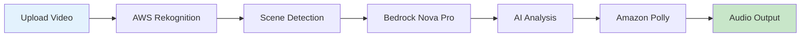

# 📋 README Implementation Guide

## 🚀 Quick Implementation Steps

### Step 1: Replace Current README
```bash
# Backup current README
mv README.md README_backup.md

# Use new README
mv README_NEW.md README.md
```

### Step 2: Create Asset Directory Structure
```bash
mkdir -p assets/{images,icons,diagrams,screenshots,gifs}
mkdir -p docs/{api,guides,examples}
mkdir -p examples/{javascript,python,react,node}
```

### Step 3: Generate Visual Assets

#### Required Immediate Assets (Priority 1)
1. **Hero Banner** - Can use gradient placeholder initially
2. **AWS Service Logos** - Download from AWS Brand Center
3. **Basic Diagrams** - Use draw.io or Mermaid.js
4. **Code Screenshots** - Use Carbon.now.sh

#### Enhancement Assets (Priority 2)
1. **Demo GIF** - Record with LICEcap or Kap
2. **Performance Charts** - Generate with Chart.js
3. **Use Case Illustrations** - Undraw.co for placeholders
4. **Interactive Elements** - CodePen embeds

## 🎨 Visual Asset Creation Tools

### Free Tools for Immediate Use

#### Hero Banner Creation
```html
<!-- Option 1: CSS Gradient Banner -->
<div style="background: linear-gradient(135deg, #0066CC 0%, #00AA44 100%); 
            padding: 60px 20px; 
            text-align: center; 
            color: white;">
  <h1>🎙️ Voice Description API</h1>
  <p>Transform Visual Content into Accessible Audio Narratives</p>
</div>
```

#### Option 2: Canva Template
- Size: 1200x400px
- Template: "GitHub Banner"
- Colors: #0066CC, #00AA44

#### Diagram Generation with Mermaid


### Badge Generation

```markdown
<!-- Custom Badges with Shields.io -->


```

## 📝 Content Templates

### Use Case Template
```markdown
### 🏢 [Industry Name]

**The Challenge**: [Specific problem in 1-2 sentences]

**Our Solution**: [How API solves it in 1-2 sentences]

**Results**: 
- 📈 [Metric 1 with percentage]
- 💰 [Metric 2 with dollar amount]
- ⏱️ [Metric 3 with time saved]

**Example Implementation**:
```javascript
// Industry-specific code example
const result = await api.process({
  // Relevant parameters
});
```

**Customer Quote**: 
> "[Testimonial]" — [Name, Title, Company]
```

### Code Example Template
```markdown
#### [Feature Name]

<details>
<summary><b>View Example</b></summary>

```javascript
// Clear comment explaining what this does
const example = async () => {
  // Step 1: Initialize
  const client = new VoiceDescriptionAPI({
    apiKey: process.env.API_KEY
  });
  
  // Step 2: Process
  const result = await client.process({
    // Parameters with comments
  });
  
  // Step 3: Handle result
  console.log(result);
};
```

**Output**:
```json
{
  "status": "success",
  "data": "..."
}
```

</details>
```

## 🔧 Technical Implementation

### GitHub-Specific Formatting

#### Collapsible Sections
```markdown
<details>
<summary><b>Click to expand</b></summary>

Content here...

</details>
```

#### Centered Content
```markdown
<div align="center">
  Content here...
</div>
```

#### Tables with Alignment
```markdown
| Left | Center | Right |
|:-----|:------:|------:|
| Text | Text   | Text  |
```

### Interactive Elements

#### Copy Button for Code Blocks
```html
<!-- Add this script to make code blocks copyable -->
<script>
document.querySelectorAll('pre').forEach(block => {
  const button = document.createElement('button');
  button.innerText = 'Copy';
  button.style.position = 'absolute';
  button.style.top = '5px';
  button.style.right = '5px';
  
  button.onclick = () => {
    navigator.clipboard.writeText(block.innerText);
    button.innerText = 'Copied!';
    setTimeout(() => button.innerText = 'Copy', 2000);
  };
  
  block.style.position = 'relative';
  block.appendChild(button);
});
</script>
```

#### Animated Progress Indicators
```html
<!-- For demo sections -->
<div style="width: 100%; background: #f0f0f0; border-radius: 10px;">
  <div style="width: 65%; background: linear-gradient(90deg, #0066CC, #00AA44); 
              padding: 10px; border-radius: 10px; color: white; 
              text-align: center; animation: progress 2s ease;">
    Processing: 65%
  </div>
</div>
```

## 📊 Analytics Integration

### Track README Engagement

```javascript
// Add to README as invisible pixel


// Or use GitHub Insights
// Repository Settings > Insights > Traffic
```

### UTM Parameters for Links
```markdown
[Get Started](https://api.voicedescription.com/signup?utm_source=github&utm_medium=readme&utm_campaign=hero_cta)
```

## 🎯 SEO Optimization

### README SEO Checklist

- [ ] Primary keyword in title (first 60 characters)
- [ ] Description in first paragraph (155 characters)
- [ ] Keywords naturally distributed (2-3% density)
- [ ] Alt text for all images
- [ ] Descriptive link text (no "click here")
- [ ] Structured headings (H1 → H2 → H3)
- [ ] Internal linking to docs
- [ ] External links to authoritative sources

### Meta Tags for GitHub Pages
```html
<!-- If using GitHub Pages -->
<meta name="description" content="AI-powered audio description API for videos and images. Make your visual content accessible with automated narration.">
<meta name="keywords" content="audio description, video accessibility, API, WCAG compliance, AI narration">
<meta property="og:title" content="Voice Description API">
<meta property="og:description" content="Transform visual content into accessible audio narratives">
<meta property="og:image" content="https://your-domain.com/assets/og-image.png">
```

## 🚦 Launch Checklist

### Pre-Launch (Day -7)
- [ ] Create all Priority 1 visual assets
- [ ] Set up asset hosting (GitHub or CDN)
- [ ] Test all code examples
- [ ] Verify all links work
- [ ] Check mobile responsiveness
- [ ] Run spell check and grammar check

### Launch Day
- [ ] Replace README.md
- [ ] Update repository description
- [ ] Add repository topics/tags
- [ ] Create initial GitHub release
- [ ] Post announcement on social media
- [ ] Submit to awesome-lists

### Post-Launch (Day +7)
- [ ] Monitor analytics
- [ ] Collect user feedback
- [ ] Fix reported issues
- [ ] Add Priority 2 assets
- [ ] Create video walkthrough
- [ ] Update based on metrics

## 📈 Performance Monitoring

### Key Metrics to Track

```javascript
// Weekly metrics review
const metrics = {
  github: {
    stars: 0,        // Target: 100 in first month
    forks: 0,        // Target: 20 in first month
    views: 0,        // Target: 1000 in first week
    unique_visitors: 0  // Target: 500 in first week
  },
  readme: {
    time_on_page: '0s',     // Target: >2 minutes
    scroll_depth: '0%',     // Target: >70%
    copy_events: 0,         // Target: 25% of visitors
    cta_clicks: 0          // Target: 10% of visitors
  },
  api: {
    signups: 0,            // Target: 50 in first week
    api_calls: 0,          // Target: 1000 in first week
    active_users: 0        // Target: 20 in first week
  }
};
```

## 🔄 Iteration Strategy

### A/B Testing Plan

#### Week 1-2: Headline Testing
```markdown
<!-- Version A -->
# Transform Videos into Accessible Audio Narratives

<!-- Version B -->
# AI-Powered Audio Descriptions in Seconds
```

#### Week 3-4: CTA Testing
```markdown
<!-- Version A -->
[Start Free Trial](link)

<!-- Version B -->
[Get Your API Key](link)
```

#### Week 5-6: Code Example Language
- Version A: JavaScript first
- Version B: Python first

### Continuous Improvement

1. **Daily**: Monitor GitHub stars/issues
2. **Weekly**: Review analytics, update examples
3. **Bi-weekly**: Add new use cases
4. **Monthly**: Major content refresh

## 🎨 Brand Consistency

### Voice & Tone Guidelines

#### Headlines
- **Active voice**: "Transform your content" not "Content can be transformed"
- **Benefit-focused**: "Save 95% of your time" not "Processes quickly"
- **Specific numbers**: "40+ languages" not "Multiple languages"

#### Body Copy
- **Conversational**: Write like you're explaining to a colleague
- **Technical when needed**: Don't oversimplify for developers
- **Scannable**: Use bullets, short paragraphs, bold key points

### Visual Consistency

```css
/* Brand Colors - Use consistently */
:root {
  --brand-primary: #0066CC;
  --brand-secondary: #00AA44;
  --text-primary: #1A1A1A;
  --text-secondary: #666666;
  --background: #FFFFFF;
  --background-alt: #F5F5F5;
}

/* Standard Border Radius */
.element {
  border-radius: 6px;  /* Small elements */
  border-radius: 8px;  /* Medium elements */
  border-radius: 12px; /* Large elements */
}

/* Standard Shadows */
.shadow-sm { box-shadow: 0 2px 4px rgba(0,0,0,0.1); }
.shadow-md { box-shadow: 0 4px 8px rgba(0,0,0,0.15); }
.shadow-lg { box-shadow: 0 8px 16px rgba(0,0,0,0.2); }
```

## 🚀 Advanced Enhancements

### Future Additions (Month 2+)

1. **Interactive Demo**
   - Embedded CodeSandbox
   - Live API playground
   - Real-time response preview

2. **Video Tutorials**
   - Getting started (5 min)
   - Advanced features (10 min)
   - Integration guides (15 min)

3. **Customer Showcase**
   - Logo wall
   - Case study links
   - Success metrics

4. **Developer Tools**
   - Postman collection
   - OpenAPI/Swagger spec
   - CLI tool

## 📞 Support Resources

### README Support Section Template

```markdown
## 💬 Support

### Documentation
- 📚 [Full Documentation](https://docs.voicedescription.api)
- 🎓 [Video Tutorials](https://youtube.com/voicedescapi)
- 💡 [Examples Repository](https://github.com/voicedesc/examples)

### Community
- 💬 [Discord Server](https://discord.gg/voicedesc)
- 🐦 [Twitter Updates](https://twitter.com/voicedescapi)
- 📧 [Newsletter](https://voicedescription.api/newsletter)

### Direct Support
- 🎫 [Submit Issue](https://github.com/voicedesc/api/issues)
- 💼 [Enterprise Support](mailto:enterprise@voicedesc.api)
- 🚨 [Status Page](https://status.voicedescription.api)
```

## ✅ Final Quality Checklist

### Content Quality
- [ ] No typos or grammar errors
- [ ] Consistent terminology
- [ ] All links tested and working
- [ ] Code examples run without errors
- [ ] Current version numbers

### Visual Quality
- [ ] Images optimized (<200KB each)
- [ ] Consistent styling throughout
- [ ] Mobile responsive layout
- [ ] Proper image alt text
- [ ] No broken image links

### Technical Quality
- [ ] API examples work
- [ ] Authentication clear
- [ ] Error handling documented
- [ ] Rate limits specified
- [ ] SDKs referenced

### Business Quality
- [ ] Value proposition clear
- [ ] Pricing transparent
- [ ] Contact information visible
- [ ] Legal links included
- [ ] Call-to-actions prominent