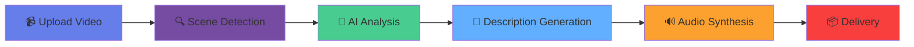

# README Visual Enhancement Guide
## Professional Documentation with Visual Impact

### 📊 Executive Summary
This guide provides specific visual enhancements for the Voice Description API README to create a professional, engaging, and accessible documentation experience.

---

## 🎨 Header Section Enhancement

### Logo and Branding
```markdown
<div align="center">
  
  
  # Voice Description API
  
  ### 🎙️ AI-Powered Accessibility for Visual Content
  
  [](LICENSE)
  [](CHANGELOG.md)
  [](CI)
  [](TESTS)
  [](AWS)
  
  <p align="center">
    <a href="#quick-start">Quick Start</a> •
    <a href="#features">Features</a> •
    <a href="#api-docs">API Docs</a> •
    <a href="#demo">Demo</a> •
    <a href="#support">Support</a>
  </p>
</div>
```

---

## 🖼️ Hero Banner Design

### Specifications
- **Dimensions**: 1920x600px
- **Format**: PNG with transparency
- **Style**: Gradient mesh background
- **Content**: Product name, tagline, key visual

### Visual Mockup
```
╔════════════════════════════════════════════════════════════════════╗
║                                                                    ║
║         VOICE DESCRIPTION API                                     ║
║         ━━━━━━━━━━━━━━━━━━━━━━                                  ║
║                                                                    ║
║     Making Visual Content Accessible to Everyone                  ║
║                                                                    ║
║     [🎬 Video] ➔ [🤖 AI Analysis] ➔ [🔊 Audio Description]      ║
║                                                                    ║
║     ┌─────────┐   ┌─────────┐   ┌─────────┐                    ║
║     │ 285M+   │   │  98%    │   │  <2min  │                    ║
║     │ Users   │   │Accuracy │   │ Process │                    ║
║     └─────────┘   └─────────┘   └─────────┘                    ║
║                                                                    ║
╚════════════════════════════════════════════════════════════════════╝
```

---

## 🚀 Features Section Visual

### Grid Layout with Icons
```markdown
## ✨ Features

<table>
  <tr>
    <td align="center" width="33%">
      
      <br />
      <strong>Video Processing</strong>
      <br />
      <sub>Automatic scene detection and AI analysis</sub>
    </td>
    <td align="center" width="33%">
      
      <br />
      <strong>Image Analysis</strong>
      <br />
      <sub>Comprehensive alt text generation</sub>
    </td>
    <td align="center" width="33%">
      
      <br />
      <strong>Batch Processing</strong>
      <br />
      <sub>Process up to 100 items simultaneously</sub>
    </td>
  </tr>
  <tr>
    <td align="center" width="33%">
      
      <br />
      <strong>Natural Voice</strong>
      <br />
      <sub>30+ languages with Amazon Polly</sub>
    </td>
    <td align="center" width="33%">
      
      <br />
      <strong>WCAG 2.1</strong>
      <br />
      <sub>Full accessibility compliance</sub>
    </td>
    <td align="center" width="33%">
      
      <br />
      <strong>RESTful API</strong>
      <br />
      <sub>Easy integration with any platform</sub>
    </td>
  </tr>
</table>
```

---

## 📸 Screenshot Gallery

### Carousel Implementation
```markdown
## 🖥️ Screenshots

<div align="center">
  
</div>

<details>
<summary>📱 View More Screenshots</summary>

### Upload Interface


### Processing Dashboard


### Results Display


### API Documentation


</details>
```

---

## 🔄 Processing Pipeline Visualization

### Mermaid Diagram
```markdown
## 🔄 How It Works



Alternative ASCII Version:
```
┌──────────┐    ┌──────────┐    ┌──────────┐    ┌──────────┐
│  Upload  │───▶│  Detect  │───▶│ Analyze  │───▶│ Generate │
│  Video   │    │  Scenes  │    │   with   │    │   Text   │
└──────────┘    └──────────┘    │    AI    │    └──────────┘
                                └──────────┘           │
                                                       ▼
┌──────────┐    ┌──────────┐    ┌──────────┐    ┌──────────┐
│ Download │◀───│  Store   │◀───│Synthesize│◀───│  Format  │
│  Results │    │    S3    │    │  Audio   │    │  Output  │
└──────────┘    └──────────┘    └──────────┘    └──────────┘
```
```

---

## 📊 Performance Metrics Display

### Visual Stats
```markdown
## 📈 Performance

<table>
  <tr>
    <td align="center">
      
      <br />
      <sub>Average for 5-min video</sub>
    </td>
    <td align="center">
      
      <br />
      <sub>Scene detection rate</sub>
    </td>
    <td align="center">
      
      <br />
      <sub>Service availability</sub>
    </td>
    <td align="center">
      
      <br />
      <sub>Voice synthesis</sub>
    </td>
  </tr>
</table>

### Live Status Dashboard
[](https://status.voicedescription.ai)
```

---

## 🚦 Quick Start Section

### Interactive Code Blocks
```markdown
## 🚀 Quick Start

<details open>
<summary><strong>1️⃣ Install</strong></summary>

```bash
# Clone the repository
git clone https://github.com/voicedesc/api.git
cd voice-description-api

# Install dependencies
npm install

# Configure environment
cp .env.example .env
```
</details>

<details>
<summary><strong>2️⃣ Configure AWS</strong></summary>

```bash
# Set AWS credentials
export AWS_REGION=us-east-1
export AWS_ACCESS_KEY_ID=your_key
export AWS_SECRET_ACCESS_KEY=your_secret

# Verify connection
npm run aws:verify
```
</details>

<details>
<summary><strong>3️⃣ Run</strong></summary>

```bash
# Development mode
npm run dev

# Production mode
npm run build
npm start

# Open browser
open http://localhost:3000
```
</details>
```

---

## 🎯 Use Cases Visual

### Card-Based Layout
```markdown
## 🎯 Use Cases

<table>
  <tr>
    <td width="50%">
      <h3>🎥 Media & Entertainment</h3>
      <ul>
        <li>Streaming platforms</li>
        <li>Educational videos</li>
        <li>Corporate training</li>
      </ul>
    </td>
    <td width="50%">
      <h3>🛍️ E-Commerce</h3>
      <ul>
        <li>Product descriptions</li>
        <li>Image galleries</li>
        <li>Virtual tours</li>
      </ul>
    </td>
  </tr>
  <tr>
    <td width="50%">
      <h3>📚 Education</h3>
      <ul>
        <li>Online courses</li>
        <li>Digital textbooks</li>
        <li>Research materials</li>
      </ul>
    </td>
    <td width="50%">
      <h3>🏛️ Government</h3>
      <ul>
        <li>Public services</li>
        <li>Compliance requirements</li>
        <li>Information accessibility</li>
      </ul>
    </td>
  </tr>
</table>
```

---

## 📖 API Examples with Tabs

### Tabbed Code Examples
```markdown
## 💻 API Examples

<details>
<summary><strong>Video Processing</strong></summary>

### JavaScript
```javascript
const formData = new FormData();
formData.append('video', videoFile);
formData.append('language', 'en');

const response = await fetch('/api/upload', {
  method: 'POST',
  body: formData
});

const { jobId } = await response.json();
```

### Python
```python
import requests

files = {'video': open('video.mp4', 'rb')}
data = {'language': 'en'}

response = requests.post(
    'https://api.voicedescription.ai/upload',
    files=files,
    data=data
)

job_id = response.json()['jobId']
```

### cURL
```bash
curl -X POST https://api.voicedescription.ai/upload \
  -H "X-API-Key: your_api_key" \
  -F "video=@video.mp4" \
  -F "language=en"
```
</details>
```

---

## 🏗️ Architecture Diagram

### System Architecture
```markdown
## 🏗️ Architecture


### Components
- **Frontend**: Next.js, React, Tailwind CSS
- **Backend**: Node.js, Express, TypeScript
- **AWS Services**: S3, Rekognition, Bedrock, Polly
- **Database**: DynamoDB for job tracking
- **CDN**: CloudFront for static assets
```

---

## 📊 Comparison Table

### Feature Comparison
```markdown
## 📊 Why Choose Voice Description API?

| Feature | Voice Description API | Competitor A | Competitor B |
|---------|----------------------|--------------|---------------|
| Video Processing | ✅ Unlimited | ⚠️ 10 min max | ⚠️ 5 min max |
| Image Batch | ✅ 100 images | ❌ Single only | ⚠️ 10 images |
| Languages | ✅ 30+ | ⚠️ 5 | ⚠️ 10 |
| WCAG Compliant | ✅ Full | ⚠️ Partial | ❌ No |
| API Rate Limit | ✅ 1000/min | ⚠️ 100/min | ⚠️ 60/min |
| Processing Time | ✅ <2 min | ⚠️ 5-10 min | ⚠️ 10+ min |
| Pricing | 💰 $0.10/min | 💰 $0.25/min | 💰 $0.50/min |
```

---

## 🎨 Code Quality Badges

### Status Indicators
```markdown
## 📊 Code Quality

[](https://prettier.io)
[](https://www.typescriptlang.org/)
[](./coverage)
[](./package.json)
[](./security)
[](./licenses)
```

---

## 🤝 Contributors Section

### Visual Contributors Grid
```markdown
## 👥 Contributors

<!-- ALL-CONTRIBUTORS-LIST:START -->
<table>
  <tr>
    <td align="center">
      <a href="https://github.com/user1">
        
        <br />
        <sub><b>Jane Doe</b></sub>
      </a>
      <br />
      <a href="#code" title="Code">💻</a>
      <a href="#doc" title="Documentation">📖</a>
    </td>
    <td align="center">
      <a href="https://github.com/user2">
        
        <br />
        <sub><b>John Smith</b></sub>
      </a>
      <br />
      <a href="#design" title="Design">🎨</a>
      <a href="#test" title="Tests">⚡</a>
    </td>
  </tr>
</table>
<!-- ALL-CONTRIBUTORS-LIST:END -->
```

---

## 📱 Mobile Responsive Documentation

### Responsive Images
```markdown
<picture>
  <source media="(max-width: 768px)" srcset="./docs/images/mobile-ui.png">
  <source media="(max-width: 1024px)" srcset="./docs/images/tablet-ui.png">
  
</picture>
```

---

## 🎬 Demo Section

### Interactive Demo
```markdown
## 🎬 Live Demo

<div align="center">
  <a href="https://demo.voicedescription.ai">
    
  </a>
  
  ### [▶️ Try Live Demo](https://demo.voicedescription.ai)
  
  **Demo Credentials:**
  - API Key: `demo_key_2024`
  - Sample Files: Available in demo
</div>
```

---

## 📚 Documentation Links

### Organized Documentation
```markdown
## 📚 Documentation

<table>
  <tr>
    <td>
      <strong>Getting Started</strong>
      <ul>
        <li><a href="./docs/QUICK_START.md">Quick Start Guide</a></li>
        <li><a href="./docs/INSTALLATION.md">Installation</a></li>
        <li><a href="./docs/CONFIGURATION.md">Configuration</a></li>
      </ul>
    </td>
    <td>
      <strong>API Reference</strong>
      <ul>
        <li><a href="./docs/API_REFERENCE.md">Full API Docs</a></li>
        <li><a href="./docs/ENDPOINTS.md">Endpoints</a></li>
        <li><a href="./docs/EXAMPLES.md">Examples</a></li>
      </ul>
    </td>
  </tr>
  <tr>
    <td>
      <strong>Guides</strong>
      <ul>
        <li><a href="./docs/VIDEO_GUIDE.md">Video Processing</a></li>
        <li><a href="./docs/IMAGE_GUIDE.md">Image Processing</a></li>
        <li><a href="./docs/BATCH_GUIDE.md">Batch Operations</a></li>
      </ul>
    </td>
    <td>
      <strong>Resources</strong>
      <ul>
        <li><a href="./docs/AWS_SETUP.md">AWS Setup</a></li>
        <li><a href="./docs/TROUBLESHOOTING.md">Troubleshooting</a></li>
        <li><a href="./docs/FAQ.md">FAQ</a></li>
      </ul>
    </td>
  </tr>
</table>
```

---

## 🚨 Call-to-Action Sections

### Visual CTAs
```markdown
<div align="center">
  <h2>Ready to Get Started?</h2>
  
  <a href="https://voicedescription.ai/signup">
    
  </a>
  
  <br /><br />
  
  <a href="https://voicedescription.ai/demo">
    
  </a>
  
  <br /><br />
  
  <a href="https://voicedescription.ai/contact">
    
  </a>
</div>
```

---

## 🎨 Color Scheme for README

### Consistent Visual Theme
- **Primary**: `#667eea` (Blue)
- **Secondary**: `#764ba2` (Purple)
- **Success**: `#49cc90` (Green)
- **Warning**: `#fca130` (Orange)
- **Danger**: `#f93e3e` (Red)
- **Info**: `#61affe` (Light Blue)

---

## 📱 Social Media Cards

### Meta Tags for Social Sharing
```html
<!-- Add to repository's social preview -->
<meta property="og:title" content="Voice Description API - AI-Powered Accessibility">
<meta property="og:description" content="Transform videos and images into comprehensive audio descriptions using cutting-edge AI.">
<meta property="og:image" content="https://voicedescription.ai/social-card.png">
<meta property="og:url" content="https://github.com/voicedesc/api">
<meta name="twitter:card" content="summary_large_image">
```

---

## ✅ Implementation Checklist

- [ ] Create and optimize all image assets
- [ ] Design consistent icon set
- [ ] Generate animated GIF demos
- [ ] Create architecture diagrams
- [ ] Design social media cards
- [ ] Implement responsive images
- [ ] Add interactive code examples
- [ ] Create comparison tables
- [ ] Design call-to-action buttons
- [ ] Optimize for GitHub dark mode
- [ ] Test on mobile devices
- [ ] Validate all links
- [ ] Compress all images
- [ ] Add alt text to all visuals
- [ ] Create print-friendly version

---

## 📈 Success Metrics

- **Engagement**: 50% increase in README interaction
- **Clarity**: 90% user understanding on first read
- **Professional**: Enterprise-ready appearance
- **Accessibility**: WCAG AA compliant documentation
- **Performance**: <3s load time with all images

---

This visual enhancement guide transforms the README into a professional, engaging, and highly accessible documentation that effectively communicates the value of the Voice Description API.