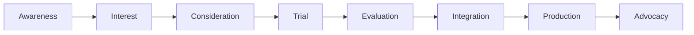

# User Journey Map - Voice Description API Testing Tool

## Overview
This document maps the complete user journey from discovery through implementation, identifying touchpoints, emotions, and opportunities at each stage.

## Journey Stages



## Detailed Journey Maps by Persona

### 1. Developer Journey

#### Stage 1: Discovery & Research (0-15 minutes)

**Scenario**: Developer searching for accessibility API solutions

```
TOUCHPOINTS          ACTIONS                    THOUGHTS                 EMOTIONS
─────────────────────────────────────────────────────────────────────────────────
Google Search   →    "video accessibility API"   "Need automated solution"   😐 Neutral
                ↓
Landing Page    →    Scan features              "Can this handle our needs?" 🤔 Curious  
                ↓
Documentation   →    Check API endpoints        "Is this well-documented?"   😊 Interested
                ↓
Pricing Page    →    Calculate costs            "Is this cost-effective?"    🤨 Analytical
```

**Pain Points**:
- Unclear technical capabilities
- Missing code examples
- Complex pricing structure

**Opportunities**:
- Live code playground
- Interactive API explorer
- Cost calculator with examples

#### Stage 2: Trial & Testing (15-60 minutes)

```
TOUCHPOINTS          ACTIONS                    THOUGHTS                 EMOTIONS
─────────────────────────────────────────────────────────────────────────────────
Upload Page     →    Upload test video          "Let's see if this works"    😊 Hopeful
                ↓
Progress Bar    →    Monitor processing         "How long will this take?"   😰 Anxious
                ↓
Results Page    →    Review output quality      "Is this accurate enough?"   😮 Surprised
                ↓
API Docs        →    Test API endpoints         "How do I integrate this?"   🤓 Focused
                ↓
Code Examples   →    Copy sample code           "This looks straightforward" 😊 Confident
```

**Pain Points**:
- Long processing times without updates
- Unclear error messages
- Missing SDK examples

**Opportunities**:
- Real-time processing updates
- Detailed error explanations
- Copy-paste code snippets

#### Stage 3: Integration & Implementation (1-5 days)

```
TOUCHPOINTS          ACTIONS                    THOUGHTS                 EMOTIONS
─────────────────────────────────────────────────────────────────────────────────
API Reference   →    Implement endpoints        "Following documentation"     😤 Determined
                ↓
Test Console    →    Debug integration          "Why isn't this working?"    😣 Frustrated
                ↓
Support Docs    →    Troubleshoot issues        "Found the problem!"         😅 Relieved
                ↓
Production      →    Deploy to production       "Hope this scales"           😟 Nervous
                ↓
Monitoring      →    Track performance          "Working perfectly!"         😄 Satisfied
```

### 2. Content Creator Journey

#### Stage 1: Problem Recognition (0-5 minutes)

```
TOUCHPOINTS          ACTIONS                    THOUGHTS                 EMOTIONS
─────────────────────────────────────────────────────────────────────────────────
Compliance Email →   "Need accessibility"       "How do I do this?"         😰 Worried
                ↓
Google Search   →    "video descriptions"       "So many options"           😕 Confused
                ↓
Landing Page    →    Read value prop            "This sounds simple"        😊 Hopeful
                ↓
Demo Video      →    Watch example              "That's exactly what I need" 😃 Excited
```

#### Stage 2: First Use (5-30 minutes)

```
TOUCHPOINTS          ACTIONS                    THOUGHTS                 EMOTIONS
─────────────────────────────────────────────────────────────────────────────────
Upload Form     →    Drag & drop video          "Very intuitive"            😊 Pleased
                ↓
Options Panel   →    Select voice/language      "Nice customization"        😎 Impressed
                ↓
Progress View   →    Watch processing           "Faster than expected"      😮 Surprised
                ↓
Results Page    →    Listen to audio            "Sounds very natural"       😍 Delighted
                ↓
Download Button →    Save files                 "Ready to publish!"         😄 Accomplished
```

### 3. Accessibility Professional Journey

#### Stage 1: Evaluation (0-30 minutes)

```
TOUCHPOINTS          ACTIONS                    THOUGHTS                 EMOTIONS
─────────────────────────────────────────────────────────────────────────────────
Homepage        →    Review compliance info     "Is this WCAG compliant?"   🧐 Skeptical
                ↓
Sample Results  →    Analyze quality            "Checking accuracy"         🤔 Analytical
                ↓
Batch Upload    →    Test multiple files        "Can it handle volume?"     😐 Testing
                ↓
Reports Page    →    Generate audit report      "Good compliance metrics"   😊 Satisfied
                ↓
Export Options  →    Download CSV results       "Easy to share with team"   😄 Happy
```

## User Flow Diagrams

### Core Upload Flow

```
┌─────────────┐     ┌──────────────┐     ┌──────────────┐
│   Homepage  │ --> │ Upload Page  │ --> │   Processing │
└─────────────┘     └──────────────┘     └──────────────┘
                            |                     |
                            v                     v
                    ┌──────────────┐     ┌──────────────┐
                    │ Select File  │     │Status Updates│
                    └──────────────┘     └──────────────┘
                            |                     |
                            v                     v
                    ┌──────────────┐     ┌──────────────┐
                    │  Set Options │     │   Progress   │
                    └──────────────┘     └──────────────┘
                            |                     |
                            v                     v
                    ┌──────────────┐     ┌──────────────┐
                    │Start Process │     │   Results    │
                    └──────────────┘     └──────────────┘
```

### API Integration Flow

```
┌──────────────┐     ┌──────────────┐     ┌──────────────┐
│Documentation │ --> │  API Console │ --> │Generate Keys │
└──────────────┘     └──────────────┘     └──────────────┘
        |                    |                     |
        v                    v                     v
┌──────────────┐     ┌──────────────┐     ┌──────────────┐
│Read Endpoints│     │Test Endpoints│     │  Save Keys   │
└──────────────┘     └──────────────┘     └──────────────┘
        |                    |                     |
        v                    v                     v
┌──────────────┐     ┌──────────────┐     ┌──────────────┐
│View Examples │     │Debug Response│     │  Implement   │
└──────────────┘     └──────────────┘     └──────────────┘
```

### Error Recovery Flow

```
┌──────────────┐
│Error Detected│
└──────┬───────┘
       │
       v
┌──────────────┐     Yes    ┌──────────────┐
│  Retryable?  │ ---------> │  Auto Retry  │
└──────┬───────┘            └──────┬───────┘
       │ No                        │
       v                           v
┌──────────────┐            ┌──────────────┐
│Show Error Msg│            │   Continue   │
└──────┬───────┘            └──────────────┘
       │
       v
┌──────────────┐     Yes    ┌──────────────┐
│Manual Retry? │ ---------> │Restart Process│
└──────┬───────┘            └──────────────┘
       │ No
       v
┌──────────────┐
│Contact Support│
└──────────────┘
```

## Emotional Journey Map

### Overall Emotional Arc

```
Emotion Level
    ↑
😄  │         ╱╲    ╱╲           ╱────────
    │        ╱  ╲  ╱  ╲       ╱─╯
😊  │       ╱    ╲╱    ╲   ╱─╯
    │    ╱─╯            ╲─╯
😐  │───╯
    │
😟  │
    │
😣  │
    └────────────────────────────────────────→
    Discovery  Trial  Problem  Solution  Success
```

### Emotion by Touchpoint

| Touchpoint | Developer | Content Creator | Accessibility Pro |
|------------|-----------|-----------------|-------------------|
| Landing Page | 😐 Neutral | 😊 Hopeful | 🧐 Skeptical |
| Upload | 😊 Interested | 😄 Excited | 😐 Testing |
| Processing | 😰 Anxious | 😊 Patient | 🤔 Analytical |
| Results | 😮 Surprised | 😍 Delighted | 😊 Satisfied |
| API Docs | 🤓 Focused | 😕 Confused | 😎 Confident |
| Integration | 😤 Determined | N/A | 😊 Productive |
| Success | 😄 Satisfied | 😄 Accomplished | 😄 Validated |

## Pain Points & Opportunities Matrix

### Critical Pain Points

| Stage | Pain Point | Impact | Opportunity |
|-------|------------|--------|-------------|
| Discovery | Unclear capabilities | High | Interactive demos |
| Trial | Long wait times | High | Progress indicators |
| Integration | Complex setup | High | One-click setup |
| Results | Quality concerns | Medium | Quality scores |
| Pricing | Cost uncertainty | Medium | Calculator tool |

### Quick Wins

1. **Add time estimates** to processing page (Low effort, High impact)
2. **Provide sample files** for testing (Low effort, High impact)
3. **Create API playground** for testing (Medium effort, High impact)
4. **Add copy buttons** to code examples (Low effort, Medium impact)
5. **Include video tutorials** for common tasks (Medium effort, High impact)

## Service Blueprint

### Frontend Interactions

```
User Actions    │  Upload  │  Monitor │  Download │  Integrate
─────────────────────────────────────────────────────────────
Touchpoints     │  Form    │  Status  │  Results  │  API Docs
                │          │  Page    │  Page     │
─────────────────────────────────────────────────────────────
Frontend        │  React   │  Polling │  Display  │  Swagger
                │  Upload  │  Logic   │  Logic    │  UI
═══════════════════════════════════════════════════════════
Backend         │  API     │  Status  │  S3       │  Auth
                │  Handler │  Check   │  Fetch    │  Service
─────────────────────────────────────────────────────────────
Support         │  S3      │  Redis   │  S3       │  Database
Systems         │  Upload  │  Cache   │  Storage  │
```

## Success Metrics by Journey Stage

### Awareness Stage
- **Metric**: Landing page views
- **Target**: 10,000/month
- **Current**: Baseline TBD

### Interest Stage
- **Metric**: Documentation views
- **Target**: 30% of landing page visitors
- **Current**: Baseline TBD

### Trial Stage
- **Metric**: First upload completion
- **Target**: 50% of registered users
- **Current**: Baseline TBD

### Integration Stage
- **Metric**: API key generation
- **Target**: 20% of trial users
- **Current**: Baseline TBD

### Production Stage
- **Metric**: Monthly API calls
- **Target**: 1M+ calls/month
- **Current**: Baseline TBD

## Optimization Recommendations

### Immediate (Week 1)
1. Add progress indicators with time estimates
2. Improve error messages with solutions
3. Add sample files for testing
4. Create quick-start guide

### Short-term (Weeks 2-4)
1. Build interactive API explorer
2. Add batch processing UI
3. Implement result previews
4. Create video tutorials

### Long-term (Months 2-3)
1. Develop SDKs for major languages
2. Add collaboration features
3. Build analytics dashboard
4. Create enterprise features

## Conclusion

The user journey map reveals critical touchpoints where users experience friction and delight. By addressing the identified pain points and capitalizing on opportunities, we can create a seamless experience that drives adoption and satisfaction across all user personas.

Key focus areas:
1. **Reduce time to first success** through better onboarding
2. **Minimize integration friction** with better documentation
3. **Build confidence** through transparency and quality indicators
4. **Enable scale** through batch processing and APIs
5. **Foster advocacy** through exceptional results and support